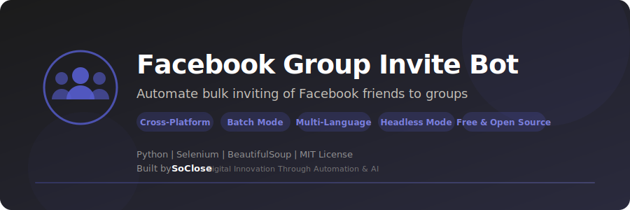

<p align="center">
  
</p>

<p align="center">
  <strong>Automate bulk inviting of Facebook friends to groups — batch processing with smart delays.</strong>
</p>

<p align="center">
  <a href="LICENSE"></a>
  <a href="https://www.python.org/downloads/"></a>
  
  <a href="https://www.selenium.dev/"></a>
  <a href="https://github.com/SoCloseSociety/FacebookInviteFriendToGroup/stargazers"></a>
  <a href="https://github.com/SoCloseSociety/FacebookInviteFriendToGroup/issues"></a>
  <a href="https://github.com/SoCloseSociety/FacebookInviteFriendToGroup/network/members"></a>
</p>

<p align="center">
  <a href="#quick-start">Quick Start</a> &bull;
  <a href="#key-features">Features</a> &bull;
  <a href="#configuration">Configuration</a> &bull;
  <a href="#faq">FAQ</a> &bull;
  <a href="#contributing">Contributing</a>
</p>

---

## What is Facebook Group Invite Bot?

**Facebook Group Invite Bot** is a free, open-source **Facebook automation tool** built with Python and Selenium. It automates the tedious process of inviting your Facebook friends to join a group. Instead of clicking through hundreds of friends one by one, this bot handles it in configurable batches with smart delays.

The bot opens Chrome, lets you log in manually, then automatically selects and invites friends in random batches — mimicking human behavior to reduce detection.

### Who is this for?

- **Community Managers** growing their Facebook group membership
- **Marketing Professionals** building engaged communities
- **Event Organizers** inviting friends to event-related groups
- **Startup Founders** bootstrapping their community
- **Social Media Managers** handling multiple group campaigns
- **Content Creators** expanding their audience reach

### Key Features

- **Batch Processing** - Invite friends in configurable random batches (5-10 per batch)
- **Multi-Language** - Supports French and English Facebook UI
- **Smart Delays** - Randomized timing between batches to avoid detection
- **Graceful Shutdown** - Press Ctrl+C to stop cleanly at any time
- **Structured Logging** - Timestamped logs for monitoring and debugging
- **Headless Mode** - Run without a visible browser window
- **Input Validation** - Validates group URLs before starting
- **Configurable Limits** - Set maximum number of invitations per session
- **Cross-Platform** - Works on Windows, macOS, and Linux
- **Free & Open Source** - MIT license, no API key required

---

## Quick Start

### Prerequisites

| Requirement | Details |
|-------------|---------|
| **Python** | Version 3.8 or higher ([Download](https://www.python.org/downloads/)) |
| **Google Chrome** | Latest version ([Download](https://www.google.com/chrome/)) |
| **Facebook Account** | A valid Facebook account with group invite permissions |

### Installation

```bash
# 1. Clone the repository
git clone https://github.com/SoCloseSociety/FacebookInviteFriendToGroup.git
cd FacebookInviteFriendToGroup

# 2. (Recommended) Create a virtual environment
python -m venv venv

# Activate it:
# Windows:
venv\Scripts\activate
# macOS / Linux:
source venv/bin/activate

# 3. Install dependencies
pip install -r requirements.txt
```

### Usage

```bash
python main.py
```

The bot will:
1. Open Chrome and navigate to Facebook
2. Wait for you to log in manually
3. Navigate to the specified group
4. Start inviting friends in batches

#### All CLI Options

```bash
python main.py --help
```

| Option | Description | Default |
|--------|-------------|---------|
| `--group-url URL` | Facebook group URL | (interactive) |
| `--lang {fr,en}` | Facebook UI language | `fr` |
| `--batch-min N` | Min friends per batch | `5` |
| `--batch-max N` | Max friends per batch | `10` |
| `--max-invites N` | Stop after N total invites (0 = unlimited) | `0` |
| `--headless` | Run Chrome without visible window | Off |
| `-v, --verbose` | Enable debug logging | Off |

#### Examples

```bash
# French Facebook, default settings
python main.py --group-url "https://www.facebook.com/groups/mygroup"

# English Facebook, batches of 3-7, max 50 invites
python main.py --group-url "https://www.facebook.com/groups/mygroup" \
               --lang en --batch-min 3 --batch-max 7 --max-invites 50

# Verbose mode for debugging
python main.py -v
```

---

## How It Works

```
Facebook Group URL
        │
        ▼
┌─────────────────────────┐
│  1. Open Chrome         │
│  2. Manual Login        │
│  3. Navigate to Group   │
├─────────────────────────┤
│  4. Click "Invite"      │
│  5. Select Random Batch │
│  6. Send Invitations    │
│  7. Wait (random delay) │
│  8. Repeat until done   │
└─────────────────────────┘
```

---

## Configuration

All settings are controlled via CLI arguments. See the [CLI Options](#all-cli-options) table above.

---

## Project Structure

```
FacebookInviteFriendToGroup/
├── main.py              # Main automation script
├── requirements.txt     # Python dependencies
├── setup.sh             # Quick installer script
├── assets/
│   └── banner.svg       # Project banner
├── LICENSE              # MIT License
├── README.md            # This file
├── CONTRIBUTING.md      # Contribution guidelines
└── .gitignore           # Git ignore rules
```

---

## Troubleshooting

### Chrome driver issues

The bot uses `webdriver-manager` to automatically download the correct ChromeDriver. If you encounter issues:

```bash
pip install --upgrade webdriver-manager
```

### Elements not found

Facebook occasionally updates its UI. If the bot can't find buttons:
1. Check the [Issues](https://github.com/SoCloseSociety/FacebookInviteFriendToGroup/issues) page for known problems
2. Try switching language with `--lang en` or `--lang fr`
3. Open a new issue with the error message

### Script stops immediately

Ensure the group URL format is: `https://www.facebook.com/groups/...`

### Permission denied

Make sure you are a member of the group with invite permissions.

---

## FAQ

**Q: Is this free?**
A: Yes. Facebook Group Invite Bot is 100% free and open source under the MIT license.

**Q: Do I need a Facebook API key?**
A: No. This tool uses browser automation (Selenium), so no API key or developer account is needed.

**Q: How many friends can I invite?**
A: There is no hard limit in the tool. Use `--max-invites` to set your own limit. Be mindful of Facebook's usage policies.

**Q: Does it work with Facebook Pages?**
A: No. This tool is designed for Facebook Groups only.

**Q: Can I run it without opening a browser?**
A: Yes. Use `--headless` mode: `python main.py --headless`

**Q: Does it work on Mac / Linux?**
A: Yes. The bot is fully cross-platform and works on Windows, macOS, and Linux.

---

## Alternatives Comparison

| Feature | Facebook Group Invite Bot | Manual Inviting | Facebook Ads |
|---------|--------------------------|-----------------|-------------|
| Price | **Free** | Free | $5-50/day |
| Bulk invite | Yes (batches) | No | N/A |
| Configurable batches | Yes | N/A | N/A |
| Open source | Yes | N/A | No |
| API key required | No | No | Yes |
| Cross-platform | Yes | Yes | Web only |
| Headless mode | Yes | N/A | N/A |

---

## Contributing

Contributions are welcome! Please read the [Contributing Guide](CONTRIBUTING.md) before submitting a pull request.

---

## License

This project is licensed under the [MIT License](LICENSE).

---

## Disclaimer

This tool is provided for **educational and personal use purposes only**. Use it responsibly and in compliance with [Facebook's Terms of Service](https://www.facebook.com/terms.php). The authors are not responsible for any misuse or consequences arising from the use of this software.

---

<p align="center">
  <strong>If this project helps you, please give it a star!</strong><br>
  It helps others discover this tool.<br><br>
  <a href="https://github.com/SoCloseSociety/FacebookInviteFriendToGroup">
    
  </a>
</p>

<br>

<p align="center">
  <sub>Built with purpose by <a href="https://soclose.co"><strong>SoClose</strong></a> &mdash; Digital Innovation Through Automation & AI</sub><br>
  <sub>
    <a href="https://soclose.co">Website</a> &bull;
    <a href="https://linkedin.com/company/soclose-agency">LinkedIn</a> &bull;
    <a href="https://twitter.com/SoCloseAgency">Twitter</a> &bull;
    <a href="mailto:hello@soclose.co">Contact</a>
  </sub>
</p>
